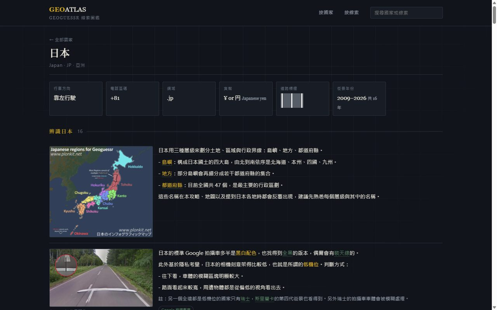
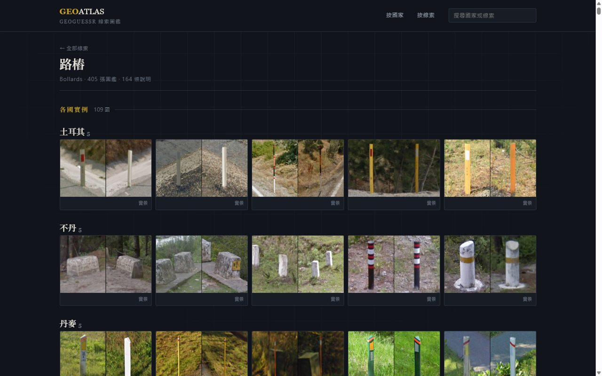
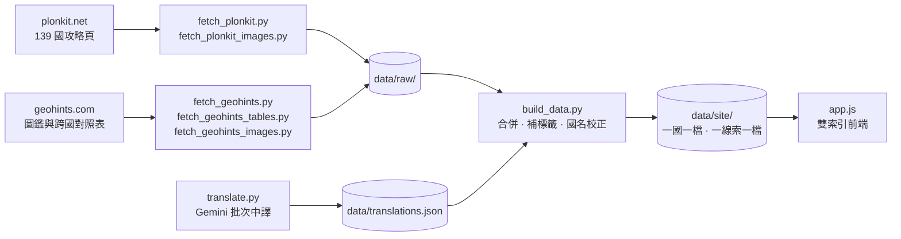

<div align="center">

<pre>
+------------------------------------------+
|                                          |
|           G E O   A T L A S              |
|                                          |
|      plonkit + geohints / zh-Hant        |
|                                          |
+------------------------------------------+
</pre>

### GeoGuessr 線索圖鑑

**把 plonkit 與 geohints 兩站的攻略整合成同一份資料庫，並全站中文化**

[](#資料規模)
[](#資料規模)
[](#資料規模)
[](#全站中文化)
[](https://currywarrior.github.io/geoguessr-guide/)

**[線上瀏覽](https://currywarrior.github.io/geoguessr-guide/)**　·　[快速開始](#快速開始)　·　[資料從哪來](#資料從哪來)　·　[全站中文化](#全站中文化)　·　[踩過的坑](#踩過的坑)


</div>

---

## 這是什麼

GeoGuessr 玩到後期，瓶頸不在反應快慢，而在腦中有沒有那本「看到什麼就想到哪裡」的對照表。
現成的兩大攻略站各有各的強項也各有各的缺口：plonkit 的國家攻略寫得深，但要一國一國翻；
geohints 的線索圖鑑橫向比對強，但沒有成篇的判斷邏輯。**這個站把兩邊併成一份資料庫，
再從兩個方向切進去查**。

| | 用途 | 情境 |
|---|---|---|
| **按國家查** | 一國的完整辨識特徵、地貌、標誌、車輛世代 | 賽前針對性複習 |
| **按線索查** | 一種線索在 109 個國家長什麼樣，並排比對 | 遊戲中看到一根沒見過的電線桿，反查是誰家的 |

所有內文、國名、段落標題、線索分類**全部是繁體中文**，術語統一（路樁、電線桿、轉彎標誌、
相機世代、低機位、礙子、分接頭），地名用台灣慣用譯名。

<table>
<tr>
<td width="50%"><br><em>國家頁：關鍵事實卡片＋分節攻略，每條說明都配實景圖</em></td>
<td width="50%"><br><em>線索頁：同一種線索在各國的實例，直接並排比對</em></td>
</tr>
</table>

## 資料規模

| 項目 | 數量 |
|---|---|
| 國家與地區 | **258**（其中 136 有完整攻略） |
| 攻略說明 | **5272** 條 |
| 線索圖鑑 | **8953** 張（磁碟 9174 檔，817 MB） |
| 線索類型 | **33** 種，分 23 類呈現 |
| 國旗 | **258** 面 SVG（geohints 220 面＋Wikimedia 補 38 面） |
| 中文譯文 | **8085** 條，119 萬字元原文譯成 50 萬字中文 |
| 站台體積 | 約 840 MB |

## 快速開始

```bash
python -m http.server 8781
```

開 <http://localhost:8781> 即可。**必須透過 HTTP**，直接用瀏覽器開 `index.html` 會因為
`fetch` 的同源限制讀不到資料。

> **不要用 8765。** 那個 port 上有 japan-travel 的 service worker，會攔截請求回傳它自己的頁面，
> 症狀是畫面莫名其妙變成「日本旅遊完全攻略」。

前端是零依賴的原生 JS，沒有打包步驟、沒有 node_modules。

## 資料從哪來



所有抓取腳本都支援中斷續跑，已抓過的會自動跳過。

<details>
<summary><b>幾個影響架構的技術決定</b></summary>

<br>

**plonkit 是 Vite SPA，但不需要跑瀏覽器渲染。** 每頁 HTML 裡都內嵌了
`<script id="__PRELOADED_DATA__">`，那就是完整的結構化 JSON，直接解析比開 headless 瀏覽器
快上兩個數量級。

**geohints 的道路標線不是圖片。** 它是用 CSS div 疊出來的，所以解析成顏色陣列存起來，
由前端自己重畫，零圖片成本也不會有解析度問題。

**譯文與網站資料分離。** 翻譯存在獨立的 `data/translations.json`（原文對譯文），
`build_data.py` 再併進去。這樣重建資料不會弄丟翻譯，翻譯本身也能隨時中斷續跑。
前端是逐條 fallback：某條沒翻就顯示該條英文原文，不必等全部翻完才能用。

**plonkit 只有 24.4% 的條目自帶線索標籤**，其餘靠 `build_data.py` 的 `KEYWORD_RULES`
從內文補標，補完覆蓋率 73%。補標的結果會標記 `tagged` 欄位，與原站標的區分開來。

</details>

## 全站中文化

8085 條說明、119 萬字元，走 Gemini 的 OpenAI 相容端點批次翻譯。這段跑起來比預期曲折，
因為 **Google 在 2026 年把免費層砍成每個模型每天 20 次請求**，而配額是「每個模型一桶」。

| 模型 | 每日請求上限 | 實測速度 |
|---|---|---|
| `gemini-flash-lite-latest` | **無此限制** | **150–180 條/分** |
| `gemini-flash-latest` | 20 | 43 條/分 |
| `gemini-2.5-flash` | 20 | — |
| `gemini-2.0-flash` | 0（免費層不開放） | — |

```bash
GROQ_BASE="https://generativelanguage.googleapis.com/v1beta/openai" \
GROQ_API_KEY=$(cat .keys/gemini.txt) python -u scripts/translate.py
python scripts/build_data.py    # 把譯文併進網站資料
```

金鑰放在 `.keys/gemini.txt`（已在 `.gitignore` 內）。撞到當日配額會自動換下一個模型，
全部用完就存檔收工，重跑從斷點接續。

<details>
<summary><b>翻譯管線踩過的坑</b></summary>

<br>

**批量要大，因為卡的是請求「次數」不是資料量。** 一批 10 條等於把額度當柴燒；
實測一批 100 條零漏譯是甜蜜點，200 條會開始漏回（送 200 回 197）反而更花請求。

**整批失敗要對半切重試，不能逐條重試。** 逐條會把 100 條的批次燒成 100 次請求，
在一天只有 20 次的世界裡等於自殺。對半切最多只多花 log2 次。

**每日配額的偵測字串很陰險。** Google 的 429 訊息裡沒有 `daily` 也沒有 `per day`，
只有 JSON 後段 `quotaId` 欄位裡的 `PerDay`，而且那個欄位在回應第 800 字元之後——
只比對前段會剛好把它切掉，腳本就會把每日配額當成一般限流無限重試空轉。

**漏譯有三種型態，只抓一種會漏掉另外兩種。** 依數量排序是：粗體 `**...**` 裡留英文
（669 處，最多）、連結顯示文字 `[...]` 留英文（183 處）、整條沒中文（200 條）。
站上粗體會染成金色，留英文會整頁跳出金色英文字。提示詞必須分別明寫這三件事。

**模型會偷改網址**（`en.wikipedia.org` 寫成 `.com`），還會自作主張替術語加粗。
這兩種用確定性腳本修比重翻可靠：連結數相同時依序把原文網址蓋回去，粗體超量的從後面拆掉。
最終驗證全站 16077 條含連結的說明**網址零改動**。

**剩下沒翻的都是刻意保留的。** 品牌名（OXXO、Pemex、Whataburger）、標誌牌面上的原文
（ALTO、GIVE WAY、PERINGATAN）、各國「街道」用字（calle、rue、straat、rruga、triq）、
地名後綴（-owo、-weiler）、拉丁學名——那些本身就是用來認國家的線索，翻掉反而毀了。

</details>

## 目錄結構

```
scripts/                      抓取與建置
  fetch_plonkit.py              139 個國家頁的內嵌 JSON
  fetch_plonkit_images.py       圖片下載並轉 WebP
  fetch_geohints.py             線索圖鑑（各國實例照片）
  fetch_geohints_tables.py      跨國對照表（左駕右駕、區碼、網域）
  fetch_geohints_images.py      圖鑑圖片，每國每類取 5 張
  build_data.py                 合併成網站資料
  translate.py                  批次中譯

data/raw/                     原始抓取結果
data/site/                    網站讀的資料
  index.json                    首頁索引
  countries/*.json              一國一檔
  clues/*.json                  一類線索一檔
  country_zh.json               國名中譯
data/translations.json        內文中譯（translate.py 產生）
assets/img/                   圖片
docs/                         README 用的截圖
```

## 部署

全站都是相對路徑，部署在子目錄也不會壞。

**GitHub Pages**（目前採用）：Settings → Pages → Source 選 `master` / `root`。
注意 Pages 有 **1 GB 的站台大小硬限制**，目前 840 MB 還在範圍內，但補圖前要留意。
真的不夠時把現有圖重壓即可，實測 1024 寬 q75 可省 47%（571 MB 降到 303 MB）。

**Cloudflare Pages**（可搭配私有 repo）：Workers & Pages → Create → Pages → Connect to Git，
framework preset 選 None、build command 留空、output directory 填 `/`。沒有 1 GB 限制。
若要限制只有自己看得到，再到 Zero Trust → Access → Applications 加一個 self-hosted 應用
指向該網域，policy 設成只允許自己的 email。

`robots.txt` 與頁面的 `noindex` 都已設好，不會被搜尋引擎收錄而跟原站競爭。

## 踩過的坑

**Cloudflare 只擋沒有瀏覽器 headers 的請求。** plonkit 的 HTML 加個 `User-Agent` 就過，
但 `/images/` 路徑更嚴格，少了 `Referer` 或 `Sec-Fetch-Dest` 會拿到 HTTP 200 但內容是
challenge 頁。所以下載後一定要驗 `Content-Type` 真的是圖片才寫檔。

**下載慢的原因不是頻寬。** 單張實測 7–8 MB/s，但整批跑只有 0.6 張/秒——瓶頸是 Cloudflare
邊緣沒快取、每張都要回源 GCS，偶發 9 到 18 秒的尖峰。靠併發隱藏延遲有效，但 12 執行緒會
踩到限流（失敗率 11.7%，全是 429），6 執行緒才穩。

**資料端與圖片端的篩選規則必須共用。** 圖鑑只下載「每國每類 5 張」，如果資料端輸出全部
11315 張，頁面上就會出現破圖。兩邊的 `PER_GROUP` 要一致。

**geohints 的旗幟與品牌 logo 是 SVG。** Pillow 開不了向量檔，直接存原檔即可，不要轉點陣。

**兩站的國名寫法不一致**，且 geohints 有幾頁的解析會把國名切壞（含 and 的國名被拆斷、
多區碼國家混入雜訊、年份被當成國名）。解法是拿 geohints 自己的國家清單頁當白名單校正。

## 版權

內容與圖片皆爬自 [plonkit.net](https://www.plonkit.net/) 與 [geohints.com](https://geohints.com/)，
版權屬原站作者。本 repo 為個人學習與自用整理，未經授權請勿轉載或商業使用。
若原站作者認為不妥，請開 issue 告知，我會立即下架。
